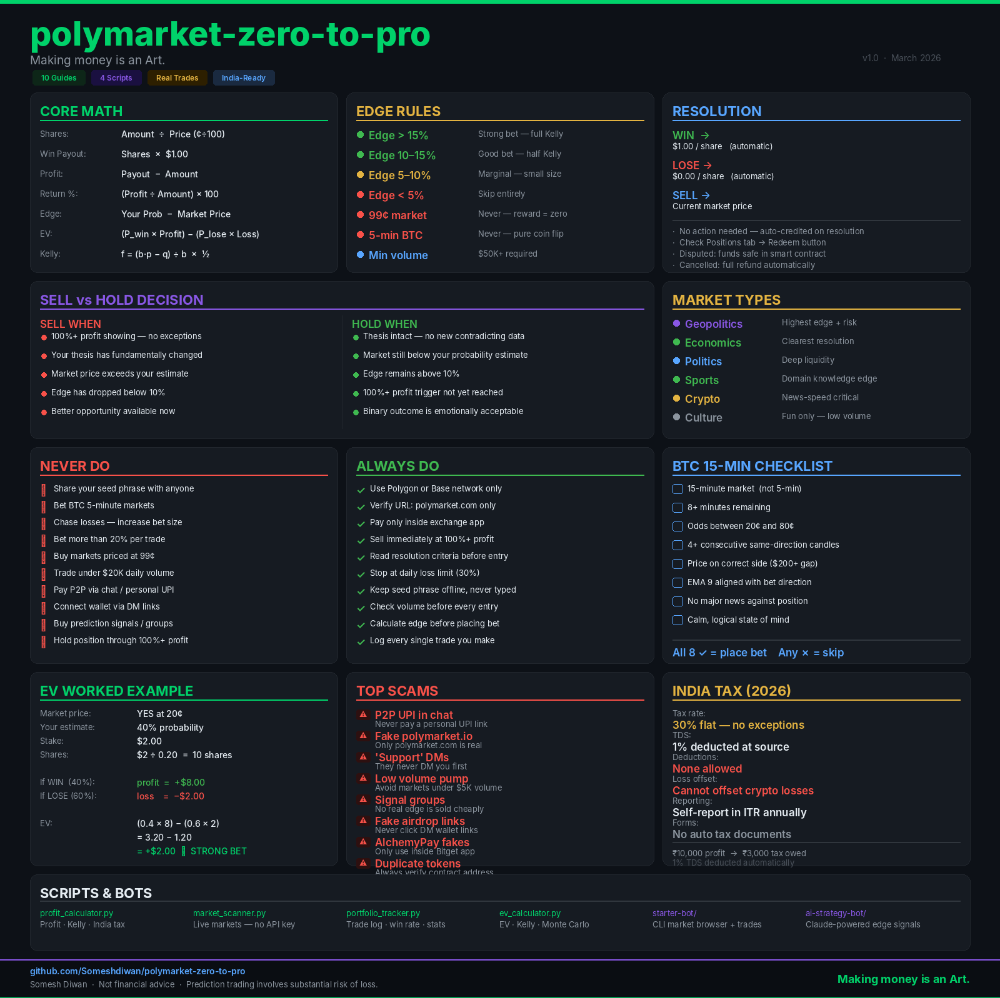

# polymarket-zero-to-pro

> Making money is an Art. Most people never pick up the brush.

A complete, honest guide to trading on [Polymarket](https://polymarket.com) built from real experience, real losses, and real profits. Covers everything from depositing your first $20 to running AI-powered trading bots.

---

## What This Is

Most crypto guides are either too basic or written by people who have never traded. This repo is different every lesson came from actual trades, including the losses. The Iran/Israel markets, the 462% profit that slipped away, the P2P scam attempt all documented here.

**Who this is for:**

- Complete beginners who want to understand prediction markets
- Intermediate traders looking for a structured edge framework
- Developers who want to build trading bots on Polymarket
- Indian traders navigating crypto infrastructure and tax rules

---

## Cheatsheet



---

## Structure

```
polymarket-zero-to-pro/
├── docs/                          ← 10 complete guides
│   ├── 01-what-is-polymarket.md
│   ├── 02-how-markets-work.md
│   ├── 03-buy-sell-hold.md
│   ├── 04-profit-loss-calc.md
│   ├── 05-auto-resolve.md
│   ├── 06-candlestick-strategy.md
│   ├── 07-quant-mindset.md
│   ├── 08-market-types.md
│   ├── 09-kalshi-vs-polymarket.md
│   └── 10-mistakes-and-scams.md
├── scripts/                       ← Run locally, no API key needed
│   ├── profit_calculator.py
│   ├── market_scanner.py
│   ├── portfolio_tracker.py
│   └── ev_calculator.py
├── bots/                          ← Automated trading
│   ├── starter-bot/
│   └── ai-strategy-bot/
├── examples/                      ← Real trade walkthroughs
│   ├── iran-israel-market.md
│   ├── btc-15min-strategy.md
│   ├── news-based-bet.md
│   └── sell-vs-hold-decision.md
├── assets/
│   ├── cheatsheet.png
│   ├── diagrams/
│   └── screenshots/
├── CONTRIBUTING.md
└── LICENSE
```

---

## Quick Start

### Read the Docs

| # | Guide | What You Learn |
|---|---|---|
| 01 | [What is Polymarket](docs/01-what-is-polymarket.md) | Platform overview |
| 02 | [How Markets Work](docs/02-how-markets-work.md) | YES/NO mechanics, share pricing |
| 03 | [Buy, Sell & Hold](docs/03-buy-sell-hold.md) | Trade execution |
| 04 | [Profit & Loss Math](docs/04-profit-loss-calc.md) | The core mathematics |
| 05 | [Auto Resolution](docs/05-auto-resolve.md) | How markets settle |
| 06 | [Candlestick Strategy](docs/06-candlestick-strategy.md) | BTC 15-min edge |
| 07 | [Quant Mindset](docs/07-quant-mindset.md) | Think like a professional |
| 08 | [Market Types](docs/08-market-types.md) | Where your edge lives |
| 09 | [Kalshi vs Polymarket](docs/09-kalshi-vs-polymarket.md) | Platform comparison |
| 10 | [Mistakes & Scams](docs/10-mistakes-and-scams.md) | What destroys traders |

### Run the Scripts

```bash
pip install colorama tabulate requests python-dotenv

python scripts/market_scanner.py --category crypto
python scripts/profit_calculator.py --amount 10 --price 25 --current 60
python scripts/ev_calculator.py --prob 40 --price 20 --stake 2
python scripts/portfolio_tracker.py
```

### Run the Bots

```bash
cd bots/starter-bot
cp .env.example .env
pip install -r requirements.txt
python main.py --dry-run --trade
```

```bash
cd bots/ai-strategy-bot
pip install -r requirements.txt
python main.py --scan --dry-run
```

---

## Real Examples

| Example | What It Covers |
|---|---|
| [Iran/Israel Market](examples/iran-israel-market.md) | Early NO bets on later dates — +567% edge explained |
| [BTC 15-min Strategy](examples/btc-15min-strategy.md) | The 462% trade that slipped away and what it taught |
| [News-Based Bet](examples/news-based-bet.md) | Fed rate cut — Reuters alert to exit, full walkthrough |
| [Sell vs Hold](examples/sell-vs-hold-decision.md) | 6 real scenarios with the complete decision tree |

---

## Core Principles

```
Edge = Your Probability − Market Price
Only bet when edge > 10%

100%+ profit showing = sell immediately
No exceptions. No "it might go higher."

Specialise in 2 categories maximum
Depth beats breadth in prediction markets

Never bet BTC 5-minute markets
Pure noise. No strategy works.

Process over outcome
A losing trade with good process is correct
A winning trade with bad process is dangerous
```

---

## Honest Disclaimer

Prediction market trading involves substantial risk of loss. Most retail traders lose money. The examples in this repo include real losses alongside wins. Past results do not predict future performance. Never deposit more than you are willing to lose completely.

---

## Contributing

See [CONTRIBUTING.md](CONTRIBUTING.md). Real examples, working code, and honest analysis always welcome.

---

## License

[MIT](LICENSE)

---

*The market prices probability. You price the market.*

---


---